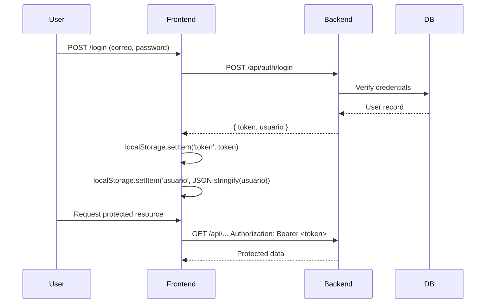

AirGuide is a full-stack SaaS application. The frontend and backend run as separate processes and communicate over HTTP.

<Columns cols={3}>
  <Card title="Frontend" icon="monitor">
    React 18 + Vite + TypeScript. Runs on port `5173`. Handles all UI, routing, and map rendering via Leaflet.
  </Card>
  <Card title="Backend API" icon="server">
    Node.js + Express. Runs on port `3001`. Exposes a REST API with JWT-based authentication.
  </Card>
  <Card title="Database" icon="database">
    PostgreSQL hosted on Prisma Cloud, accessed through Prisma ORM. Prisma Studio available for direct inspection.
  </Card>
</Columns>

## Frontend

The frontend is built with **React 18**, **TypeScript**, and **Vite 6**. UI components are composed from **Radix UI** primitives and **Material UI**, styled with **Tailwind CSS v4**. Interactive campus maps are rendered with **Leaflet** and **react-leaflet**.

```bash
npm run dev   # starts Vite dev server on http://localhost:5173
npm run build # production build
```

### Route structure

Client-side routing is handled by **React Router v7** (`createBrowserRouter`). The full route tree defined in `src/app/routes.ts`:

```typescript routes.ts
export const router = createBrowserRouter([
  { path: '/',        Component: Map },              // Public map (landing)
  { path: '/login',   Component: Login },
  { path: '/register', Component: Register },
  { path: '/map',     Component: ProtectedMap },     // Authenticated users
  {
    path: '/admin',
    Component: ProtectedAdminLayout,                 // Admin-only layout
    children: [
      { index: true,           Component: AdminDashboard },
      { path: 'edificios',     Component: EdificiosManagement },
      { path: 'events',        Component: EventsManagement },
      { path: 'salones',       Component: SalonesManagement },
      { path: 'analytics',     Component: Analytics },
    ],
  },
  { path: '*', Component: RedirectToHome },
]);
```

`ProtectedMap` and `ProtectedAdminLayout` wrap routes that require authentication or admin role respectively. Any unmatched path redirects to the home route.

## Backend API

The backend is an **Express** server written in Node.js. It serves a REST API under the `/api` prefix and listens on `PORT=3001` by default.

All protected endpoints require an `Authorization: Bearer <token>` header. The token is a signed JWT with expiry configured via `JWT_EXPIRES_IN`.

<Note>
  The frontend reads `VITE_API_URL` at build time. If unset, it falls back to `http://localhost:3001/api`. This is defined in `AuthContext.tsx`.
</Note>

## Database

The database is **PostgreSQL**, hosted on **Prisma Cloud**. The backend accesses it exclusively through **Prisma ORM**.

Prisma Studio provides a browser-based UI for inspecting tables and editing records:

```bash
cd server && npm run prisma:studio
```

The `DATABASE_URL` in `.env` points to the shared cloud instance with SSL and connection pooling enabled.

## Auth flow



- On successful login, the backend returns a JWT (`token`) and the user object (`usuario`).
- Both are stored in `localStorage` under the keys `token` and `usuario`.
- Subsequent requests to the backend include the token as a `Bearer` header.
- On logout, both keys are removed from `localStorage` and React state is cleared.

<Warning>
  Newly registered accounts have `estado: pendiente`. They cannot access protected routes until an admin approves them.
</Warning>

## Context providers

<Columns cols={2}>
  <Card title="AuthContext" icon="lock">
    Provides `user`, `login`, `register`, `logout`, and `isAdmin`. Initialises from `localStorage` on mount so the session persists across page reloads. `isAdmin()` returns `true` when `user.rol === 'admin'`.
  </Card>
  <Card title="ThemeContext" icon="sun">
    Manages light/dark theme state across the application via `next-themes`.
  </Card>
</Columns>

## Data layer — custom hooks

All backend data fetching is encapsulated in custom React hooks exported from `src/app/hooks/index.ts`. Each hook mounts automatically and calls the relevant backend endpoint.

| Hook | Data | Description |
|---|---|---|
| `useEdificios` | `Edificio[]` | Campus buildings. |
| `useEventos` | `Evento[]` | Campus events. |
| `useRutas` | `Ruta[]`, `RutaDetalle` | Navigation routes between locations. |
| `useAnalytics` | `DashboardStats` | Aggregate usage statistics for the admin dashboard. |
| `useUsuarios` | `Usuario[]` | Registered user records (admin only). |
| `useSalones` | `Salon[]` | Classrooms within buildings. |

<Tip>
  Import hooks from the barrel export: `import { useEdificios, useEventos } from '@/app/hooks'`.
</Tip>
